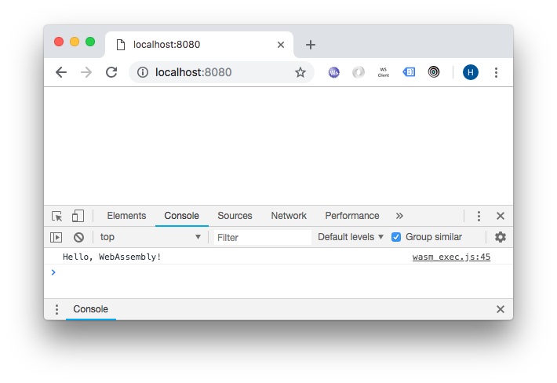

# GoLang course

Following the course at https://www.udemy.com/cursodego

## Requirements

1. Git
2. Go 1.11+
3. Docker
4. MySQL client
5. MongoDB client
6. Makefile (Optional)

## Clone

```sh
mkdir -p ~/go/src/github.com/humbertodias && cd $_
git clone https://github.com/humbertodias/go-course
cd go-course
```

Resolve dependencies

```
go get -d ./...
```

## Run

1. Variables

```
go run fundamental/variables/main.go
```

2. GoBuild

```
GOOS=linux go build -o myapp intermediate/gobuild/main.go
./myapp
```
eg.

| GOOS | Platform |
|------|----------|
| Mac  | darwin   |
| Win  | windows  |


3. Array

```
go run intermediate/array/main.go
```

4. Slice

```
go run intermediate/slice/main.go
```

5. File - Reading

```
go run intermediate/files/reading/main.go
```

5.1 File - SwfHeader

```
go run intermediate/files/swf/main.go intermediate/files/swf/race.swf
```

6. File - Writing

```
go run intermediate/files/writing/main.go
```

7. GoRoutine

```
go run intermediate/routines/main.go
```

8. Interfaces

```
go run intermediate/interfaces/main.go
```

9. Channel

```
go run intermediate/channel/main.go
```

10. Channel Select

```
go run intermediate/select/main.go
```

11. Web GET

```
go run advanced/web-get/main.go
```

12. Web POST

```
go run advanced/web-post/main.go
```

13. UnMarshall

```
go run advanced/unmarshall/main.go
```

14. Web Server

```
go run advanced/web-server/main.go
```
Then Open

http://localhost:8081/

http://localhost:8081/hello

http://localhost:8081/funcao

15. DataBase (SQL/NoSQL)

Start Server

```
docker run \
-e MYSQL_ALLOW_EMPTY_PASSWORD=yes \
-e MYSQL_ROOT_PASSWORD= \
-e MYSQL_DATABASE=go-course \
-p 3306:3306 \
-d mysql
```
and

```
docker run \
-e MONGODB_USERNAME=go \
-e MONGODB_PASSWORD=go \
-e MONGODB_DATABASE=go-course \
-p 27017:27017 \
-d bitnami/mongodb
```

Load

```
mysql -h localhost -P 3306 -D go-course -u root < advanced/database/resources/ddl.sql
mysql -h localhost -P 3306 -D go-course -u root < advanced/database/resources/dml.sql
```

```
mongoimport --uri mongodb://go:go@localhost:27017/go-course \
--collection local \
--jsonArray --file advanced/database/resources/places.json
```

Run

```
go run advanced/database/main.go
```

Then Open

http://localhost:8181/sql/45

http://localhost:8181/nosql/99


16: Web ASM

```
cd advanced/web-asm
GOOS=js GOARCH=wasm go build -o main.wasm
cp $(go env GOROOT)/misc/wasm/wasm_exec.js .

go get -u github.com/shurcooL/goexec
goexec 'http.ListenAndServe(":8080", http.FileServer(http.Dir(".")))'
```
Then open the browser

http://localhost:8080

And check out the console.log




# References

[GoLang](https://golang.org)

[Udemy GoLang Course](https://www.udemy.com/cursodego)

[Go Build](https://golang.org/pkg/go/build)

[Go WebASM](https://github.com/golang/go/wiki/WebAssembly)
